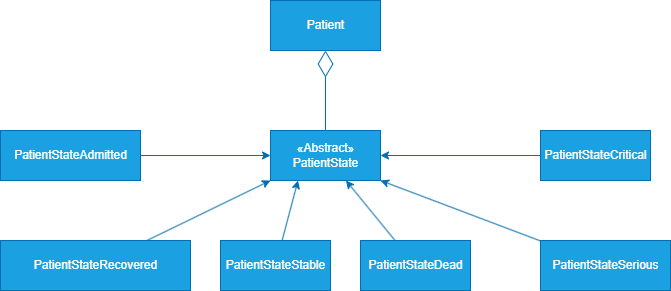
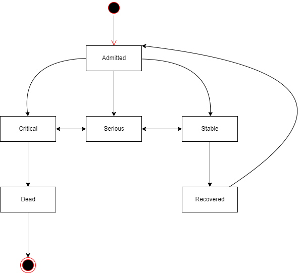

# State
A simple implementation of the State pattern in java.

# Explanation

The State pattern is a behavioral design pattern that allows an object to change its behavior when its internal state changes. The pattern encapsulates states into separate classes and delegates the state-specific behavior to these classes. This makes it easier to add new states without changing the context class.

# Class Diagram

# State Diagram

